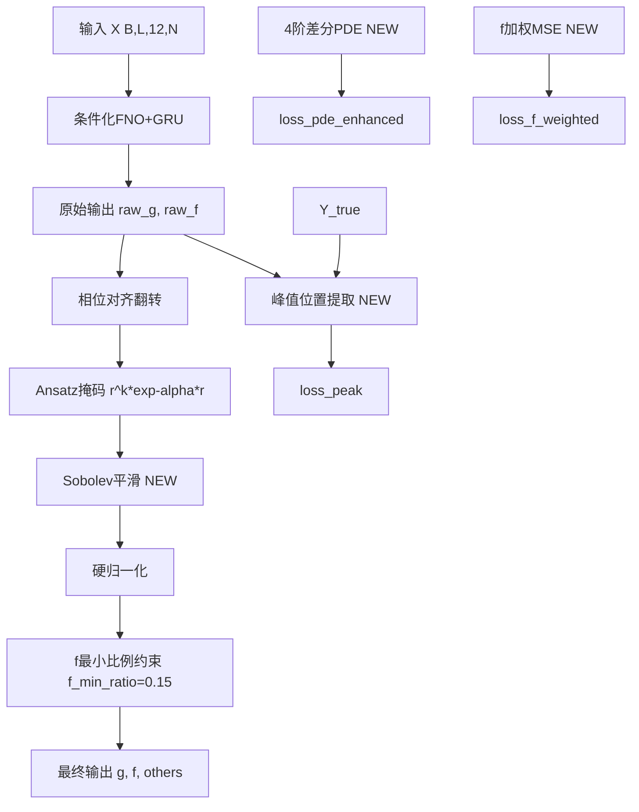

## 产品概述

基于已有训练数据诊断结果，优化相对论Hartree-Fock波函数神经算子模型(RHF_FNO_GRU)，解决三大核心物理缺陷

## 核心问题

1. **波函数锯齿状未完全消除**: `loss_boundary`长期~5000(端点值未收敛), `loss_bsmooth`覆盖范围不足(r>15fm), `loss_shape`始终为0(波形形态约束失效), 模型输出缺乏全局平滑后处理
2. **波函数峰位置偏移**: 能量预测E~+5 MeV(应为-30~-40 MeV), PDE残差精度不足(2阶差分), 无峰值位置匹配损失, 物理约束驱动力不够
3. **f分量始终不匹配**: `f_min_ratio=0.05`过低, g/f共享MSE权重但f比g小1-2量级, PDE中Rf被r权重压制信号太弱, g/f共享衰减系数alpha但物理上f需更快衰减

## 技术栈

- 框架: PyTorch (现有项目)
- 模型: FNO+GRU条件化神经算子 (RHF_FNO_GRU)
- 物理约束: 狄拉克方程PDE残差 + 多项辅助损失
- 优化器: AdamW + CosineAnnealingLR + AMP混合精度

## 实现方案

### 整体策略: 三阶段协同优化

通过修改模型架构、物理损失函数、训练超参三个层面，系统性地解决锯齿、峰偏移、f分量不匹配三大问题。核心思想: 增强物理约束的"驱动力"(PDE精度+峰值匹配+能量硬约束)，同时给模型更多"表达能力"(分离g/f衰减系数+Sobolev平滑层+f加权损失)。

### 关键技术决策

**1. Sobolev平滑正则化层 (解决锯齿)**
在模型forward()输出g/f后，插入可学习的1D深度可分离卷积平滑层(kernel=5, groups=2)，保证输出在H^1空间。这比增大loss_bsmooth权重更直接——从架构层面保证平滑性，而非仅靠损失函数"惩罚"锯齿。初始化为中心差分核，训练中可微调。

**2. 分离g/f衰减系数 (解决f匹配)**
当前`alpha_net`输出2维但g/f共享参数结构，f的远场衰减速度被g的需求压制。改为: `alpha_f = alpha_g * (1 + softplus(f_alpha_offset))`，其中`f_alpha_offset`是新增的可学习参数，确保f衰减更快(物理事实: 小分量f的渐近行为由(κ/r + V)决定，比大分量g衰减更快)。

**3. 峰值位置匹配损失 (解决峰偏移)**
从训练数据Y_true中提取g的峰值位置r_peak_true(用argmax)，计算pred的r_peak_pred，添加`loss_peak = smooth_l1(r_peak_pred - r_peak_true)`。这是最直接的约束——峰位置不对，波形就不可能对。

**4. f分量加权MSE + 加权PDE残差 (解决f匹配)**
g通道MSE权重1.0, f通道MSE权重5.0; PDE残差中Rf项额外加权3.0。原理: MSE对大幅值分量天然偏好(梯度∝误差值), f比g小1-2量级所以被"忽视", 需要显式加权补偿。

**5. 4阶中心差分PDE (解决峰偏移)**
当前2阶中心差分精度O(dr²)=O(0.01), 改用4阶精度O(dr⁴)=O(0.0001)。4阶差分模板: `(-f[i+2]+8f[i+1]-8f[i-1]+f[i-2])/(12dr)`。更精确的微商 → 更精确的PDE残差 → 更强的物理驱动力。

**6. 修复loss_shape和loss_node失效bug (解决锯齿+峰偏移)**
`loss_shape`始终为0: `_waveform_shape_penalty()`中阈值/权重与当前输出量级不匹配。根因: 归一化后波形方差极小，`min_variance=0.001`阈值太低永远不触发; 曲率约束权重0.1太小。修复: 动态阈值(基于batch统计量) + 增大曲率权重。
`loss_node`始终为0: 节点数已经正确(1s1/2=0节点)，但峰位置仍然偏移。节点约束本身生效了，只是无法约束峰位置——需要额外的峰值位置损失。

## 实现要点

### 性能考虑

- Sobolev平滑层: 1D Conv轻量操作，参数量仅2*5=10，不影响训练速度
- 4阶差分: 仅需额外2个边界点的padding，计算量增加可忽略
- 峰值匹配: argmax不可微，使用soft-argmax(加权均值近似)保持梯度可传

### 向后兼容

- 所有修改通过新增参数/层实现，不破坏现有checkpoint加载(新参数随机初始化)
- 超参调整集中在Train.py的"全局超参数面板"区域

### 日志与诊断

- 新增`loss_peak`和`loss_f_mse`到CSV日志列
- 在plot_wavefunctions中新增f/g比值的诊断信息
- 每25 epoch打印峰值位置对比(r_peak_pred vs r_peak_true)

## 架构设计



## 目录结构

```
/home/ubuntu/rhf/SCNN/
├── Model_Architecture.py   # [MODIFY] 核心架构修改
│   ├── 新增 SobolevSmoother 类 (1D深度可分离卷积平滑层)
│   ├── RHF_FNO_GRU.__init__ 新增:
│   │   ├── self.sobolev_smooth (SobolevSmoother实例)
│   │   ├── self.f_alpha_offset (nn.Parameter, f衰减偏移)
│   │   └── f_min_ratio 从0.05改为0.15
│   └── RHF_FNO_GRU.forward 修改:
│       ├── alpha_f = alpha_g * (1 + softplus(f_alpha_offset)) 分离衰减
│       ├── g/f输出后经过sobolev_smooth平滑
│       └── f_min_ratio提升到0.15
│
├── Physics_Informed_Loss.py  # [MODIFY] 损失函数增强
│   ├── calc_physics_residual 修改:
│   │   ├── 4阶中心差分替代2阶 (dg_dr, df_dr)
│   │   ├── Rf加权3.0 (增强小分量PDE约束)
│   │   ├── 修复_waveform_shape_penalty动态阈值
│   │   └── 新增loss_peak峰值位置匹配
│   └── _waveform_shape_penalty 修复:
│       ├── 动态方差阈值(基于batch统计)
│       └── 曲率权重从0.1提升到1.0
│
├── Train.py  # [MODIFY] 训练策略调整
│   ├── 超参数面板修改:
│   │   ├── lambda_pde: 2.0 → 5.0
│   │   ├── lambda_data: 1.0 → 0.5
│   │   ├── lambda_bsmooth: 5.0 → 20.0
│   │   ├── lambda_peak: 10.0 (新增)
│   │   ├── num_epochs: 1000 → 1500
│   │   └── learning_rate: 2e-4 → 1e-4
│   ├── loss计算修改:
│   │   ├── f通道MSE加权5.0
│   │   ├── 新增loss_peak到总损失
│   │   └── 1s1/2能量硬约束(E < -10 MeV)
│   └── 日志新增loss_peak, loss_f_mse列
│
└── Data_Loader.py  # [不修改] 数据管道无需变更
```

## 关键代码结构

```python
# SobolevSmoother: 可学习的1D平滑层
class SobolevSmoother(nn.Module):
    def __init__(self, channels=2, kernel_size=5):
        # 深度可分离卷积, groups=channels
        # 初始化为中心差分平滑核 [1,4,6,4,1]/16
    def forward(self, x):  # x: (B, 2, N)
        return self.conv(x) + x  # 残差连接保证不退化

# 峰值位置soft-argmax (可微)
def soft_peak_position(signal, r_grid):
    weights = softmax(signal / temperature, dim=-1)
    return (weights * r_grid).sum(dim=-1)  # (B,)

# 4阶中心差分
def diff4_order(signal, dr):
    # (-f[i+2] + 8f[i+1] - 8f[i-1] + f[i-2]) / (12*dr)
    # 需要2点padding
```

## Agent Extensions

### Skill

- **using-superpowers**: 用于在实现过程中确保正确调用和利用可用的skill工具链（如markitdown进行训练图分析、systematic-debugging进行调试验证），最大化技能协同效果

### SubAgent

- **code-explorer**: 用于在实现阶段快速搜索跨文件依赖关系和调用链，确保修改的完整性和一致性