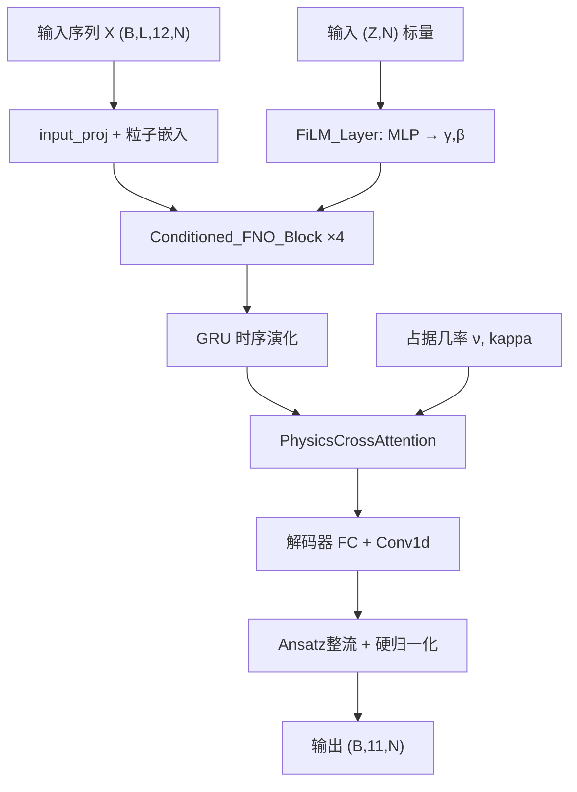

## 产品概述

按照PDF论文《RHF-SCNN: 包含宏观量子数调制的条件化时空神经算子》架构规范，对现有SCNN进行大改，实现三个级联模块：宏观条件编码器、物理交叉注意力层、条件化FNO+GRU时序演化。同时将训练目标从"预测下一步波函数"改为"预测最终收敛束缚态波函数"，训练策略改为课程学习三阶段。

## 核心功能

- 新增宏观条件编码器：将(Z,N)标量通过MLP映射为FiLM调制因子(γ,β)，在FNO每层GELU激活前注入，使网络感知不同核素的平均势场背景
- 新增物理交叉注意力层：以局域平均场为Q、全部单粒子波函数为K/V、轨道占据几率ν为权重，复刻DFT密度求和ρ(r)=Σν_i ψ_i†ψ_i
- 重构FNO Block为条件化版本：在频域积分+局域代数映射后、GELU激活前施加FiLM调制
- 数据目标重构：Y_target从"下一步波函数"改为"该state最终loop的收敛态波函数"；每个样本附加(Z,N)标量
- 课程学习训练管线：3阶段（双幻核预热→全核素多体耦合→极小值寻优），物理损失Sigmoid平滑上升
- 修复绘图反归一化：绘制的波函数还原为真实物理量纲

## 技术栈

- 框架: PyTorch (已确认项目使用)
- 模型: 1D FNO + FiLM + CrossAttention + GRU
- 训练: AMP混合精度 + DDP分布式 + 课程学习
- 数据: WAV/POT文件解析，PyTorch Dataset/DataLoader

## 实现方案

### 核心架构变更

当前架构: `SpectralConv1d → FNOBlock1D(GELU(fno+conv1x1)) → GRU → Linear`
目标架构: `SpectralConv1d → Conditioned_FNO_Block(GELU(FiLM(fno+conv1x1))) → PhysicsCrossAttention → GRU → Linear`

关键决策：

1. **FiLM调制位置**：严格按照论文公式(1)，在GELU激活前施加γ⊙x+β，而非残差连接后。这确保宏观量子数在每次非线性变换前都干预隐空间能量尺度。
2. **PhysicsCrossAttention设计**：由于当前训练是逐state独立样本，同batch内不同样本属于不同state/orbital，真正的DFT密度求和需要同一核素所有占据轨道的波函数。实现方案：在batch内按(Z,N,is_proton)分组，同组样本交叉计算密度，不足时用自身波函数近似。
3. **Y_target改为最终收敛态**：用户明确"final就是最终数据"，直接取每个state排序后的最后一个loop文件作为target，不再做复杂的收敛性判断。
4. **课程学习3阶段**：严格按论文，Epoch 1-50仅双幻核+λ=0，Epoch 51-150全核素+λ Sigmoid升至0.1，Epoch 151-200余弦退火LR。

### 性能考量

- FiLM调制是逐元素操作，复杂度O(B×d×N)，几乎无额外开销
- PhysicsCrossAttention需O(B²)注意力计算，但B较小(≤256)且仅在GRU后应用一次，可接受
- 课程学习前期数据量小(仅16O+40Ca)，训练速度反而更快

## 架构设计



## 目录结构

```
/home/ubuntu/rhf/SCNN/
├── Model_Architecture.py   # [大改] 新增FiLM_Layer, Conditioned_FNO_Block, PhysicsCrossAttention; 重构RHF_FNO_GRU
├── Data_Loader.py          # [大改] Y_target改为最终loop; 新增Z,N元数据; 简化_check_converged
├── Train.py                # [大改] 课程学习3阶段; 传递Z,N给模型; 修复绘图反归一化
└── Physics_Informed_Loss.py # [小改] 基本保留，调整接口适配新模型输出
```

### 文件详细改动说明

**Model_Architecture.py** [大改]

- 新增 `FiLM_Layer(nn.Module)`: MLP(cond_dim=2, hidden_dim=d) → Linear(hidden_dim, d*2) → chunk成γ,β; forward: γ⊙x+β
- 新增 `Conditioned_FNO_Block(nn.Module)`: 替代FNOBlock1D; 内含SpectralConv1d + Conv1x1 + FiLM_Layer + GELU; forward顺序: fno+conv1x1 → FiLM调制 → GELU
- 新增 `PhysicsCrossAttention(nn.Module)`: Q=平均场投影, K/V=波函数投影, weight=ν_i占据几率; 输出密度调制后的特征
- 重构 `RHF_FNO_GRU.forward()` 签名: 新增 `z_num`, `n_num` 参数; 将(Z,N)归一化后传入FiLM; spatial_extractor改为Conditioned_FNO_Block; GRU输出经PhysicsCrossAttention再解码; 保留alpha_net和硬归一化

**Data_Loader.py** [大改]

- 新增 `ISOTOPE_ZN` 字典: 核素名→(Z,N)映射，覆盖所有isotopes
- `_RHF_Dataset.__init__`: 每个样本存储该核素的(Z,N)标量
- `_RHF_Dataset.__getitem__`: 返回六元组 (X, Y, kappa, is_proton, actual_len, (Z,N))
- L346: `Y_11ch = traj_tensor[min(end, L_total - 1)]` → `Y_11ch = traj_tensor[-1]` (取最终loop)
- `_check_converged`: 简化，用户明确"final就是最终数据"，可直接返回True或仅做极端值过滤(>1000)
- `build_datasets`: 传递(Z,N)信息，支持课程学习动态切换isotopes

**Train.py** [大改]

- 新增核素→(Z,N)映射工具函数
- 课程学习3阶段实现: 维护`active_isotopes`列表，根据epoch切换; 重建DataLoader
- 物理损失权重: λ_physics按Sigmoid从0升至0.1(而非当前线性从0升至0.2/0.3)
- 模型forward调用: 传入z_num, n_num张量
- 绘图函数`plot_wavefunctions`: 添加反归一化步骤 `pred_denorm = pred_norm * std + mean`
- CSV日志新增Z,N列

**Physics_Informed_Loss.py** [小改]

- `calc_physics_residual`: 接口不变，内部微调dr参数适配新npt(201→可能变化)
- 新增 `compute_asymptotic_loss` 独立调用入口（当前已有但未在训练中启用，课程学习第3阶段可启用）

## 关键代码结构

```python
# FiLM调制层 - 核心条件化原语
class FiLM_Layer(nn.Module):
    def __init__(self, cond_dim=2, hidden_dim=64):
        # MLP: (Z,N) → γ,β 向量
        self.mlp = nn.Sequential(
            nn.Linear(cond_dim, hidden_dim),
            nn.GELU(),
            nn.Linear(hidden_dim, hidden_dim * 2)
        )
    def forward(self, x, cond):
        # x: (B, d, N), cond: (B, 2)
        gamma, beta = self.mlp(cond).chunk(2, dim=-1)
        return gamma.unsqueeze(-1) * x + beta.unsqueeze(-1)

# 条件化FNO块 - 替代原有FNOBlock1D
class Conditioned_FNO_Block(nn.Module):
    def __init__(self, channels, modes=32):
        self.fno = SpectralConv1d(channels, channels, modes)
        self.conv1x1 = nn.Conv1d(channels, channels, 1)
        self.film = FiLM_Layer(cond_dim=2, hidden_dim=channels)
        self.gelu = nn.GELU()
    def forward(self, x, macro_cond):
        return self.gelu(self.film(self.fno(x) + self.conv1x1(x), macro_cond))
```

## SubAgent

- **code-explorer**: 用于在实现阶段快速定位各文件中需要修改的精确行号和依赖关系，确保改动不遗漏