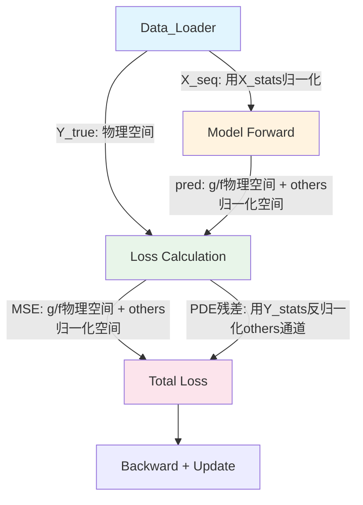

## 产品概述

基于RHF（相对论Hartree-Fock）自洽场计算数据，调试并优化条件化时空神经算子(SCNN)模型，使其能正确拟合O-16等核素的单粒子波函数。

## 核心问题

当前训练1000 epoch后模型收敛到错误解：MSE=1.025、归一化积分=0.47（远偏离1.0）、训练完全停滞。根本原因是多个级联Bug导致归一化空间失真、数据丢失和优化方向错误。

## 核心特征

- 修复归一化策略：X和Y分别计算统计量，消除Y目标空间失真
- 修复数据丢弃Bug：将极端值检查移到归一化之后，恢复12%被误杀的质子态数据
- 统一模型输出与MSE目标空间：消除硬归一化与归一化空间MSE的矛盾
- 修正Physics_Informed_Loss反归一化逻辑：使用Y的统计量
- 优化超参数：batch_size、学习率、损失权重、课程学习调度
- 修复代码Bug：缩进错误等

## 技术栈

- 框架: PyTorch (现有)
- 模型: RHF_FNO_GRU (FNO+GRU+FiLM条件化)
- 数据: RHF自洽场迭代数据（WAV/POT/FINAL文件）

## 实现方案

### 核心策略：分离X/Y归一化空间 + 物理空间MSE

**方案原理**：当前的根本矛盾是模型输出在"归一化空间"做MSE，但模型内部对g/f做了物理空间硬归一化（∫(g²+f²)dr=1），导致两个空间不匹配。解决方案是：

1. X输入仍用X的stats归一化（输入空间归一化合理）
2. 模型输出g/f通道直接在物理空间做MSE（不经过归一化）
3. 势场等通道(E, vv除外)使用Y独立的stats归一化
4. Physics_Informed_Loss使用Y的stats做反归一化

### 关键修改清单

#### 1. Data_Loader.py — 修复数据丢弃Bug

- `_parse_single_step()` 第551行：删除 `if np.max(np.abs(g)) > 100.0` 的归一化前检查
- 将极端值检查移到归一化之后（与`_check_extreme()`逻辑一致）：归一化后检查 `|g_norm| < 50 and |f_norm| < 50`

#### 2. Train.py — 修复归一化策略 + 超参数

- 新增 `calculate_y_stats()` 函数：单独计算Y目标（最终收敛态）的11通道统计量
- 训练循环中：X用x_mean/x_std归一化，Y用y_mean/y_std归一化
- **但g/f通道（0,1通道）的MSE改为物理空间计算**：模型输出直接与Y_true的g/f做MSE，不经过归一化
- 势场通道(2-8)用Y的stats归一化后做MSE
- E通道(9)和vv通道(10)特殊处理：E是常数，vv是0或1，用Y的stats归一化
- 修复第578行缩进错误
- 调整超参数：
- batch_size: 1024→32（匹配数据量）
- learning_rate: 1e-4→5e-4（补偿小batch）
- lambda_data: 0.05→1.0（恢复数据拟合引导力）
- lambda_pde: 10.0→2.0（降低PDE过度压制）
- num_epochs: 1000→300（足够收敛）
- 课程学习: Phase1=30, Phase2=100, Phase3=200（对齐PDF规范）
- `_evaluate()` 同步使用y_stats
- 物理损失中传入y_mean/y_std

#### 3. Model_Architecture.py — 消除输出空间矛盾

- 模型forward输出改为混合空间：g/f通道输出物理值（已完成硬归一化），其余通道输出归一化空间值
- 或者更简洁方案：**模型输出全部在物理空间**，删除模型内部对g/f归一化值的额外处理，仅保留ansatz约束
- 具体实现：forward返回的pred_x中，g/f通道已经是物理空间值（硬归一化后），其余通道(delta_x[:,2:])是网络原始输出
- 在训练循环中分别对g/f和其余通道用不同方式计算MSE

#### 4. Physics_Informed_Loss.py — 修复反归一化

- `calc_physics_residual()` 接收y_mean/y_std参数（而非x的stats）
- 反归一化使用Y的统计量：`pred_tensor = pred_tensor_norm * y_std_T + y_mean_T`
- 但g/f通道如果已在物理空间，则跳过反归一化
- 需要增加一个参数指示哪些通道已在物理空间

### 实现注意事项

1. **数据量验证**：修复Bug2后，16O的质子态(1s1/2等)数据将被恢复，训练样本从12增至~20+
2. **梯度流保护**：模型硬归一化中的norm_factor计算必须保持可微，确保梯度能流回网络参数
3. **反归一化一致性**：Physics_Informed_Loss中反归一化后，g/f的物理值量级应在O(1)（因为数据已经过归一化预处理），vms量级在O(-10)
4. **MSE分通道权重**：由于各通道物理量级差异大（g~0.3 vs vms~-9），物理空间MSE需按通道分配权重或使用通道级归一化
5. **AMP混合精度**：Physics_Informed_Loss中的中心差分和Rg/Rf计算需注意float16溢出，SpectralConv1d已禁用autocast

### 架构设计



### 目录结构

```
SCNN/
├── Data_Loader.py              # [MODIFY] 修复_parse_single_step()极端值检查顺序(551行)，先归一化再检查
├── Train.py                    # [MODIFY] 核心修改：
                                #   - 新增calculate_y_stats()函数
                                #   - 分离X/Y归一化统计量
                                #   - 修改MSE计算：g/f物理空间，others用Y_stats归一化
                                #   - 修复578行缩进错误
                                #   - 超参数调整(batch_size/lr/lambda/epochs)
                                #   - _evaluate()同步修改
├── Model_Architecture.py       # [MODIFY] forward返回混合空间输出：
                                #   - g/f: 物理空间（硬归一化后）
                                #   - others: 保持现有逻辑
                                #   - 输出注释明确标注各通道空间
├── Physics_Informed_Loss.py    # [MODIFY] 使用Y_stats反归一化：
                                #   - 新增y_stats参数
                                #   - g/f通道跳过反归一化（已在物理空间）
                                #   - others通道用Y_stats反归一化
```